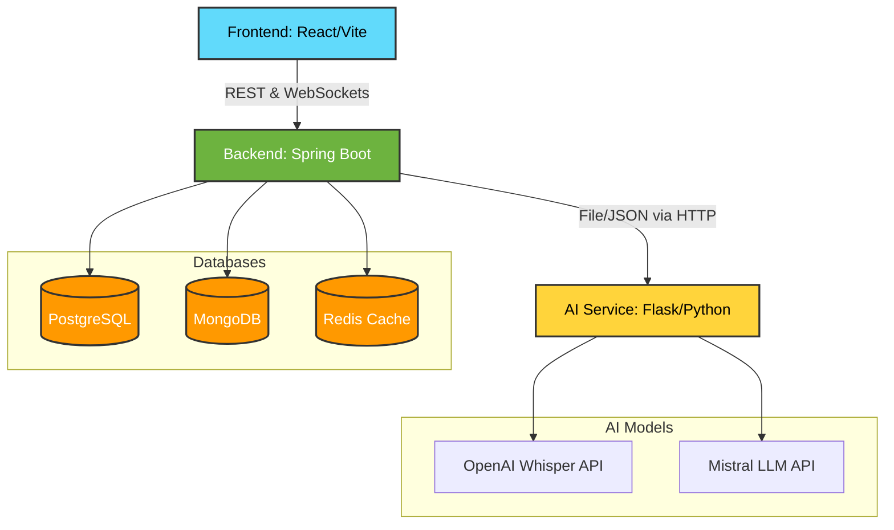

<div align="center">
  
# 🎙️ Academic Meeting Minutes Extractor

**An advanced, AI-powered web platform designed to streamline academic and departmental communications.**

[-success?style=for-the-badge)]()
[]()
[]()
[]()
[]()
[]()

*Automatically generate rich meeting minutes, extract critical action items, assign tasks to team members, and archive content for semantic search.*

</div>

---

## 🌟 Key Features

The Academic Meeting Minutes Extractor is built to eliminate the administrative burden of documenting meetings. 

| Feature | Description | Status |
| :--- | :--- | :---: |
| 🎙️ **Intelligent Transcription** | Automated, highly accurate transcription using OpenAI's Whisper framework. Maps speaker timings effortlessly. | ✅ |
| 🧠 **Action Item Extraction**| Leverages Mistral LLM to parse discussions, extracting actionable tasks, deadlines, and direct assignees. | ✅ |
| 📅 **Meeting Series** | Organize ongoing weekly or monthly departmental meetings with ease. | ✅ |
| 🔍 **Semantic Search** | Instantly search through historical minutes, past action items, and raw transcripts. | ✅ |
| 🔔 **Automated Notifications** | Background chron-jobs send email reminders to users with pending tasks and invitations. | ✅ |
| 📄 **Export Options** | Export generated minutes straight to beautifully formatted PDF and Word Document files. | ✅ |

---

## 🏗️ System Architecture

The project is built on a robust, microservices-driven architecture running in a containerized environment via **Docker Compose**:



### 1. 🖥️ Frontend Client (React & Vite)
- **Frameworks:** React 18, Vite, TypeScript
- **UI/UX Design:** Tailwind CSS & shadcn/ui components for a premium aesthetic
- **State Management:** Redux Toolkit & React Query (`@tanstack/react-query`)
- **Key Functionality:** Multi-step wizards for meeting creation, Real-time WebSockets via STOMP, Interactive `Recharts`-based analytics.

### 2. ⚙️ Backend Core (Spring Boot)
- **Core:** Java 21, Spring Boot 3.x
- **Security:** Spring Security (OAuth2 client + JWT token validation)
- **Resilience:** Circuit breaking via `Resilience4j` for fault-tolerant remote AI calls.
- **Documents:** Automated PDF and Word Doc generation using Apache PDFBox/POI and Flying Saucer.

### 3. 🧠 AI Processing Service (Python & Flask)
- **Transcription:** OpenAI Whisper framework for high-accuracy speech-to-text.
- **Extraction:** Mistral 7B LLM API utilized for NLP summarization and intelligent action item tracking.
- **Resilience:** Fallback rule-based extraction algorithms instantly invoked if the LLM REST API experiences downtime.

---

## 💾 Multi-Database Strategy

The application implements a multi-database approach optimized for diverging workloads:
1. **PostgreSQL (Relational):** Caches and handles rigorous ACID transactions for core domains like `Users`, `Meetings`, `MeetingSeries`, and `ActionItems`. 
2. **MongoDB (NoSQL Document):** Perfect for massive text buffers including full-text `Transcripts`, `AIExtractions`, and `Historical Documents`.
3. **Redis (In-Memory):** Speeds up session management, caching, and fast queue-processing.

---

## 🔌 API Overview

The backend exposes a highly optimized REST API with dozens of tested endpoints:
- **`Auth`:** Secure JWT and OAuth2 flows (`/api/auth/*`)
- **`Meetings`:** Full CRUD, transcript fetching, processing triggers, and document downloads (`/api/v1/meetings/*`)
- **`Action Items`:** Task management, acknowledgments, and reassignments (`/api/v1/action-items/*`)
- **`Dashboard & Search`:** Aggregated stats, upcoming events, and semantic search queries (`/api/v1/dashboard/*`, `/api/v1/search/*`)

*(For a full list of endpoints, refer to the local `endpoints_report.md`)*

---

## 🚀 Getting Started

### Prerequisites
- [Docker & Docker Compose](https://www.docker.com/)
- [Java 21](https://jdk.java.net/21/) (For local backend adjustments)
- [Node.js 20+](https://nodejs.org/) (For local frontend adjustments)
- [Python 3.12](https://www.python.org/)

### Local Development Environment

The quickest way to spin up the entire ecosystem and its respective databases is via docker-compose:

```bash
# 1. Clone the repository
git clone https://github.com/your-org/academic-meeting-minutes.git
cd academic-meeting-minutes

# 2. Start the services locally
docker-compose up --build -d

# 3. Monitor the background containers
docker-compose logs -f
```

### Accessing the Applications
- **Frontend App:** [http://localhost:5173](http://localhost:5173) 
- **Backend API:** [http://localhost:8080](http://localhost:8080)
- **AI Service:** [http://localhost:5001](http://localhost:5001)

---

## 🛠️ Project Phases Completed

- [x] **Phase 1: Architecture & Security** — Oauth2 + JWT, DB schema setups.
- [x] **Phase 2: Database Connectivity** — Hybrid Postgres & Mongo integration alongside JPA/Document interfaces.
- [x] **Phase 3: Core Application Workflows** — Dashboard, Semantic Search, Automated notifications.
- [x] **Phase 4: AI Pipeline Processing** — Audio file chunking, Whisper transcription algorithms, and Mistral LLM extractions.
- [x] **Phase 5: Testing & UI Polish** — Unit/integration test suites, UI revamp and finalization.
- [ ] **Phase 6: Deployment** — Container orchestration, cloud hosting, and production release (Pending).

---

## 📄 License & Contact

Maintained by the **Academic R&D Team**. 
Distributed under the **MIT License**.

For module-specific queries, please check the local `HELP.md` within the `/backend` and `/frontend` directories.
