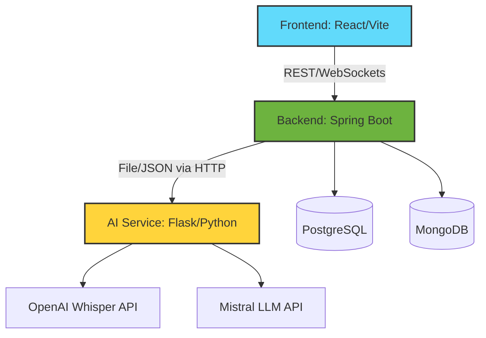

# 🎙️ Academic Meeting Minutes Extractor

<!-- Badges -->


An advanced, AI-powered web platform designed to streamline academic and departmental communications. By uploading audio recordings of meetings, the application autonomously generates rich meeting minutes, extracts critical action items, assigns tasks to team members, and archives content for semantic search.

---

## 🏗️ System Architecture

The project consists of three distinct microservices running in a containerized environment using **Docker Compose**:



### 1. 🖥️ Frontend (React & Vite)
- **Frameworks:** React 18, Vite, TypeScript
- **UI/UX Design:** Tailwind CSS & shadcn/ui components
- **State Management:** React Query (`@tanstack/react-query`)
- **Key Functionality:** Multi-step wizards for meeting creation, Real-time WebSockets via STOMP, Interactive `Recharts`-based analytics.

### 2. ⚙️ Backend (Spring Boot 3.5.x)
- **Core:** Java 21, Spring Boot
- **Security:** Spring Security (OAuth2 client + JWT token validation)
- **Resilience:** Circuit breaking via `Resilience4j` for fault-tolerant remote AI calls.
- **Real-Time & Notifications:** WebSockets with STOMP, Spring Mail integrated with Thymeleaf templates for automated task assignments.
- **Documents:** Automated PDF and Word Doc generation using Apache PDFBox/POI and Flying Saucer.

### 3. 🧠 AI Service (Python & Flask)
- **Transcription:** OpenAI Whisper framework for high-accuracy speech-to-text.
- **Extraction:** Mistral LLM API utilized for NLP summarization and intelligent action item tracking.
- **Resilience:** Fallback rule-based extraction algorithms are instantly invoked if the LLM REST API experiences downtime.

---

## 🌟 Key Features

| Feature | Description | Status |
| :--- | :--- | :---: |
| **Audio Processing** | Automated transcription mapping speaker timings using Whisper. | ✅ |
| **Action item Parsing**| Extracts tasks, deadlines, and assignees directly from transcripts. | ✅ |
| **Meeting Series** | Organize ongoing weekly or monthly departmental meetings easily. | ✅ |
| **Semantic Search** | Search through historical minutes and transcripts from the dashboard. | ✅ |
| **Task Reminders** | Background chron-jobs send email reminders to users with pending tasks. | ✅ |
| **Export Options** | Export generated minutes straight to beautifully formatted PDF and Word Document files. | ✅ |

---

## 💾 Databases

The application implements a multi-database approach optimized for diverging workloads:
1. **PostgreSQL (Relational):** Caches and handles rigorous ACID transactions for core domains like `Users`, `Meetings`, `MeetingSeries`, and `ActionItems`. 
2. **MongoDB (NoSQL Document):** Perfect for massive text buffers including full-text `Transcripts`, `AIExtractions`, and `Historical Documents`.

---

## 🚀 Getting Started

### Prerequisites
- [Docker & Docker Compose](https://www.docker.com/)
- [Java 21](https://jdk.java.net/21/) (For local backend adjustments)
- [Node.js 20+](https://nodejs.org/) (For local frontend adjustments)
- [Python 3.12](https://www.python.org/)

### Local Development Environment

The quickest way to spin up the entire ecosystem and its respective databases is via docker-compose:

```bash
# 1. Clone the repository
git clone https://github.com/your-org/academic-meeting-minutes.git
cd academic-meeting-minutes

# 2. Start the services locally
docker-compose up --build -d

# 3. Monitor the background containers
docker-compose logs -f
```

### Accessing the Applications
- **Frontend App:** [http://localhost:5173](http://localhost:5173) (Typical Vite Port)
- **Backend API:** [http://localhost:8080](http://localhost:8080)
- **AI Service:** [http://localhost:5001](http://localhost:5001)
- **PostgreSQL Database:** `localhost:5432` 

---

## 🛠️ Project Phases Completed

- [x] **Phase 1: Architecture & Security** — Oauth2 + JWT, DB schema setups.
- [x] **Phase 2: Database Connectivity** — Hybrid Postgres & Mongo integration alongside JPA/Document interfaces.
- [x] **Phase 3: Core Application Workflows** — Dashboard, Semantic Search, Automated notifications.
- [x] **Phase 4: AI Pipeline Processing** — Audio file chunking, Whisper transcription algorithms, and Mistral LLM extractions.

---

## 📄 License & Contact

Maintained by the **Academic R&D Team**. 
For module-specific queries, please check the local `HELP.md` within the `/backend` and `/frontend` directories.
